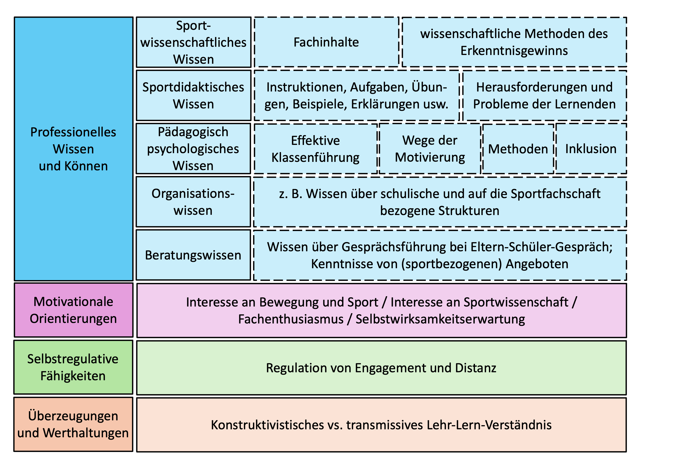

<!--
author: Tim Heemsoth
email: tim.heemsoth@uni-flensburg.de
version: 0.0.1
language: de
narrator: Deutsch Female

import:  https://raw.githubusercontent.com/EUF-SpoWis/M1_Einfuehrung_Sportwissenschaft/refs/heads/main/config.md

-->

# Einführung in die Lehveranstaltung

| Parameter                | Kursinformationen                                                                               |
| ------------------------ | ----------------------------------------------------------------------------------------------- |
| **Veranstaltung:**       | @config.lecture                                                                                 |
| **Semester:**            | @config.semester                                                                                |
| **Hochschule:**          | `Europa-Universität Flensburg`                                                                  |
| **Inhalte:**             | `Motivation der Vorlesung und Beschreibung der Organisation der Veranstaltung`                  |
| **Link auf GitHub:**     | https://github.com/EUF-SpoWis/M1_Einfuehrung_Sportwissenschaft/blob/main/00_Einfuehrung.md      |
| **Autoren:**             | @author                                                                                         |

> (c) Alle Rechte vorbehalten. 

## Fragen zum Start

{{0-1}}
***************************************************************************************************************************************************************************************
**Woher kommst du?**

[[SH nördlich]]         aus Schleswig-Holstein nördlich des Nord-Ostsee-Kanals
[[SH südlich]]          aus Schleswig-Holstein südlich des Nord-Ostsee-Kanals
[[Hamburg]]             nachbarländer: HH, BR, NI, MP
[[anderes Bundesland]]  anderes Bundesland
[[Ausland]]             Ausland
***************************************************************************************************************************************************************************************

{{1-2}}
***************************************************************************************************************************************************************************************
**In welchem Bewegungsfeld hast du am meisten Erfahrung gesammelt?**

[[Spielen]]                  Spielen
[[Tanz]]                     Gestalten und Darstellen, Turnen
[[Laufen, Springen, Werfen]] Laufen, Springen, Werfen
[[Kämpfen]]                  Mit/gegen Partner kämpfen
[[Fitness]]                  Fitnesssport
***************************************************************************************************************************************************************************************

{{2-3}}
***************************************************************************************************************************************************************************************
**Was motiviert dich zum Sportstudium?**

    [[___]]
***************************************************************************************************************************************************************************************

{{3-4}}
***************************************************************************************************************************************************************************************
**Was hat dich zur Wahl der EUF als Studienstandort bewogen?**

    [[___]]
***************************************************************************************************************************************************************************************

{{4-5}}
***************************************************************************************************************************************************************************************
**Welche Aussage hätte am ehesten von der Sportlehrkraft kommen können, die dir am meisten im Gedächtnis geblieben ist?**

[[Los]]                 „Kinder, hier ist der Ball, bildet Mannschaften, 11 gegen 11 und los geht‘s“
[[Wissenschaftler*in]]  „Ok Leute, differenziert doch nun einmal die verschiedenen Trainingsmethoden hinsichtlich des möglichen Aufkommens der anaeroben Schwelle.“
[[Besprecher*in]]       „Leute, Leute, Leute. So, Stopp erst mal... Das Problem müssen wir nun als Gruppe gemeinsam klären.“
[[Termine]]             „Wir hören heute etwas früher auf, ich habe noch einen wichtigen Termin.“
[[Gefühle]]             „Wie habt ihr Euch dabei gefühlt?“
****************************************************************************************************************************************************************************************************

{{5-6}}
****************************************************************************************************************************************************************************************************
**Welche Aussage könnte später am ehesten auf dich zutreffen??**

[[Los]]                 „Kinder, hier ist der Ball, bildet Mannschaften, 11 gegen 11 und los geht‘s“
[[Wissenschaftler*in]]  „Ok Leute, differenziert doch nun einmal die verschiedenen Trainingsmethoden hinsichtlich des möglichen Aufkommens der anaeroben Schwelle.“
[[Besprecher*in]]       „Leute, Leute, Leute. So, Stopp erst mal... Das Problem müssen wir nun als Gruppe gemeinsam klären.“
[[Termine]]             „Wir hören heute etwas früher auf, ich habe noch einen wichtigen Termin.“
[[Gefühle]]             „Wie habt ihr Euch dabei gefühlt?“
****************************************************************************************************************************************************************************************************

## Semesterüberblick

<!-- data-type="none" -->
| Veranstaltungstitel                                                                                                                    | Was lernst du hier?                                                                   |
| -------------------------------------------------------------------------------------------------------------------------------------- | -------------------------------------------------------------------------------------- |
| [00 Einführung](00_Einfuehrung.md)                                                                                                     | Die große Vision                                                                       |
| [01 Grundlagen](01_Grundlagen.md)                                                                                                      | Sport, Wissenschaft, Sportwissenschaft                                                 |
| [02 Exemplarisch: Naturwissenschaftliche Teildisziplinen](02_Exemplarisch_Naturwissenschaftliche_Teildisziplinen.md)                   | Sportwissenschaftliche Phänomene aus naturwisenschaftlicher Perspektive                |
| [03 Exemplarisch: Sozialwissenschaftliche Teildisziplinen](03_Exemplarisch_Sozialwissenschaftliche_Teildisziplinen.md)                 | Sportwissenschaftliche Phänomene aus gesellschaftswissenschaftlicher Perspektive       |
| [04 How do we catch our cats? - Qualitatives Forschen](04_Qualitatives_Forschen.md)                                                    | Grundlagen sportwissenschaftlichen Arbeits, qualiatives Forschen                       |
| [05 How do we catch our cats? - Quantitatives Forschen](05_Quantitatives_Forschen.md)                                                  | Grundlagen sportwissenschaftlichen Arbeits, quantitatives Forschen                      |
| [07 Abschluss und Klausurvorbereitung](07_Abschluss.md)                                                                                | Rückblick auf das Semester, Hinweise zur Klausur                                       |

## Worum geht es? - Einstiegsbeispiel

 
	<iframe src="https://uni-flensburg.cloud.panopto.eu/Panopto/Pages/Embed.aspx?id=3a6c214e-815c-44f6-857f-b3760109780e&autoplay=false&offerviewer=true&showtitle=true&showbrand=true&captions=false&interactivity=all" style="border: 1px solid #464646; position: absolute; top: 0; left: 0; width: 100%; height: 100%; box-sizing: border-box;" allowfullscreen allow="autoplay" aria-label="In Panopto integrierter Videoplayer" aria-description="Video 1"></iframe>

Video 1

## Zu erwerbende Kompetenzen

## Organisatorisches 

### Zugang zu Materialien

> - **Öffentlich zugängliches Material**: Lege dir einen GitHub-Account an (Link s. [Seite 1](#einführung-in-die-lehveranstaltung)). Es empfiehlt sich, den Kurs am Ende des Semesters in den eigenen Account zu kopieren. 
> - **Geschütztes Material**: Findest du im Moodle-Kurs "HeSe[JJ] Einführende Perspektiven in die Sportwissenschaft"

### Prüfung

> - Diese Vorlesung gehört zum Modul PSW "Einführende Perspektiven in die Sportwissenschaft" 
> - Das Modul PSW umfasst auch die Vorlesung "Grundlagen der Sportpädagogik und Sportdidaktik", die im FrSe angeboten wird. 
> - Nach dem FrSe wird das Modul PSW mit einer schriftlichen Klausur über beide Vorlesungen abgeschlossen. 

## Sportstudium an der EUF 

### Aufbau des BA-Studiums

<!-- data-type="none" -->           
|Kürzel| Modul                                                    | Semester | Typ                 |SWS   |Prüfungsleistung                                       | LP |
|------| ---------------------------------------------------------|----------|---------------------|------|-------------------------------------------------------|----|
|PSW   | Einführende Perspektiven in die Sportwissenschaft        |1 & 2     | 2 x Vorlesung       |3     |Klasuur                                                |5   |
|NSW   | Naturwissenschaftliche Grundlagen von Sport und Bewegung |1         | Vorlesung & Seminar |3     |Klausur                                                |5   |
|LLB   | Lehren und Lernen von Bewegungen                         |1-3       | Seminar / Übung     |7     |Praktische Prüfungen; Hausarbeit oder mdl. Prüfung.    |10  |
|LLS   | Lehren und Lernen in Sportspielen                        |4 & 5     | Seminar / Übung     |5     |Praktische Prüfung; Klausur                            |5   |         
|TPM   | Fachdidaktisches Theorie-Praxis-Modul                    |3         | Seminar             |2     |Portfolio (unbenotet)                                  |5   |    
|BFT   | Bewegungsgestaltung, Freizeit- und Trendsportarten       |3 & 4     | Seminar / Übung     |4     |Praktische Prüfung                                     |5   |    
|SPG   | Sport und Gesundheit                                     |4         | Vorlesung & Seminar |3     |Klausur                                                |5   | 
|VSW   | Sport in Europa - Verhaltens- und Sozialwiss. Grundlagen |5         | Vorlesung           |3     |Klausur                                                |5   |
|RMS   | Research Methods for Sport Studies                       |5         | Seminar             |2     |Hausarbeit oder mdl. Prüfung                           |5   |
|SKJ   | Sportpädagogik des Kindes- und Jugendalters              |6         | Seminar             |2     |Klausur                                                |5   |
|AT1   | Ausgewählte Themen der Sportwissenschaft I[^1]           |6         | Seminar             |2     |mdl. Prüfung oder Präsentationsprüfung                 |5   |
|AT2   | Ausgewählte Themen der Sportwissenschaft II[^2]          |5         | Seminar             |2     |mdl. Prüfung oder Präsentationsprüfung                 |5   |

[^1]  Studierende mit dem Ziel Lehramt an Gemeinschaftsschulen, Gymnasium oder berufliche Schulen und mit dem Ziel fachwissenschaftlicher Masterstudiengang

[^2]  Studierende mit dem Ziel erziehungswissenschaftlicher oder fachwissenschaftlicher Masterstudiengang

### Institut für Sportwissenschaft und Team
??[Institut](https://www.uni-flensburg.de/sport)

### Studiendokumente

{{0-3}}
****************************
**Rechtliche Verankerung** 

Die [Fachprüfungsordnung](https://www.uni-flensburg.de/die-universitaet/organisation-und-struktur/satzungen-und-ordnungen/dokumente-zum-studium/ba-bildungwissenschaften) informiert über den rechtlich verankerten Rahmen des Studiums. 
****************************

{{1-3}}
****************************
**Informierende Dokumente** 

Das [Modulhandbuch](https://www.uni-flensburg.de/die-universitaet/organisation-und-struktur/satzungen-und-ordnungen/dokumente-zum-studium/ba-bildungwissenschaften) informiert über die Inhalte, Prüfungsformate, Semestrigkeit und den geplanten Workload der einzelnen Module. 
****************************

{{2-3}}
****************************
**Sportspezifische Dokumente**

 Auf den Seiten des Sportinstituts findet ihr auch Angaben 
- ... zum Studienverlauf im sportwissenschaftlichen Teilstudiengang
- ... zu den [sportpraktischen Prüfungen](https://www.uni-flensburg.de/sport/studierende/pruefungen-in-den-bewegungsfeldern). 

****************************

### Studieninformation

> Auf den Seiten des Instituts für Sportwissenschaft findet ihr Informationen zur Studienberatung und Fragen der [Anerkennung von an anderen Institituionen erbrachten Leistungen](https://www.uni-flensburg.de/sport/studierende/studienberatung-und-anerkennung).

### Rechercheaufträge

> **Recherchiere in der Fachprüfungsordnung die folgenden Informationen**
> 
> * Wie viele Leistungspunkte werden für das Modul 3 vergeben?
> * In welchen Lehrveranstlatungen besteht eine Anwesenheitspflicht?
> * Welches Prüfungsformat ist im Modul "Lehren und Lernen in den Sportspielen" vorgesehen?
> * In wechem Semester liegt das Modul "Sportpädagogik des Kindes- und Jugendalters"?
> * In welcher Lehveranstaltung muss eine Prüfungsvorleistung erbracht werden?
>
> **Recherchiere auf den Seiten des Instituts für Sportwissenschaaft**
>
> * Wie viele Prüfungsteile umfasst die praktische Prüfung im Bewegungsfeld Laufen, Springen und Werfen?
> * Welche Prüfungsleistung im Bewegunsgfeld Bewegen im Wasser ist notwendig für die Note 2,3? 
> * Wer verantwortet die Studienberatung im Bachelor Teilstudiengang Sportwissenschaft?
> * Wer leitet den Arbeitsbereich Bewegungs- und Trainingswissenschaft?

## Übungsfragen

Aus wie vielen Veranstaltungen besteht das Modul "Sport und Gesundheit"?

- [[ ]] 1
- [[x]] 2
- [[ ]] 3
- [[ ]] 4

Wer bietet die Studienberatung im Bachelor im Fach Sport an?

- [[ ]] Meike Starke
- [[ ]] Tobias Regenbrecht
- [[ ]] Tim Heemsoth
- [[x]] Nele Schlapkohl

Mit welcher Prüfungsleistung endet das Modul "Lehren und Lernen in den Sportspielen"?

- [[x]] Klausur
- [[ ]] Mündlche Prüfung
- [[ ]] Hausarbeit
- [[x]] Praktische Prüfung

Wie viele Leistungspunkte werden im Modul "Bewegungsgestaltung, Freizeit- und Trendsportarten" erworben?

- [[ ]] 5
- [[ ]] 7
- [[x]] 10
- [[ ]] 12

Welche Studierende besuchen das Modul "Ausgewählte Themen der Sportwissenschaft I"?

- [[x]] Studierende mit dem Ziel berufliche Schulen.
- [[ ]] Studierende mit dem Ziel Grundschullehramt.
- [[x]] Studierende mit dem Ziel Gemeinschaftsschule oder Gymnasium.
- [[x]] Studierende mit dem Ziel fachwissenschaftlicher Masterstudiengang.

Mit welcher Note wird in der Veranstaltung "Laufen, Springen Werfen" eine Weitsprungleistung von 4,20 m bei den Studentinnen bewertet?

- [[ ]] 2,0
- [[ ]] 2,3
- [[x]] 2,7
- [[ ]] 3,0

## Hausaufgabe

> Lies bis zur nächsten Veranstaltung den folgenden Text... 