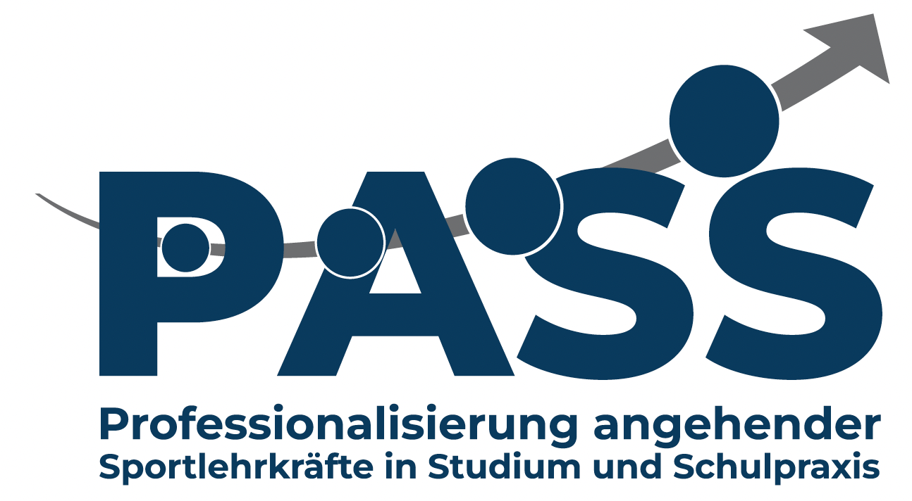

<!--
author: Tim Heemsoth
email: tim.heemsoth@uni-flensburg.de
version: 0.0.1
language: de
narrator: Deutsch Female

import:  https://raw.githubusercontent.com/EUF-SpoWis/BA_PSW_Einfuehrung_Sportwissenschaft/refs/heads/main/config.md

-->

# Einführung

| Parameter                | Kursinformationen                                                                               |
| ------------------------ | ----------------------------------------------------------------------------------------------- |
| **Veranstaltung:**       | @config.lecture                                                                                 |
| **Semester:**            | @config.semester                                                                                |
| **Hochschule:**          | `Europa-Universität Flensburg`                                                                  |
| **Inhalte:**             | `Motivation der Vorlesung und Beschreibung der Organisation der Veranstaltung`                  |
| **Link auf GitHub:**     | https://github.com/EUF-SpoWis/BA_PSW_Einfuehrung_Sportwissenschaft/blob/main/01_Einfuehrung.md      |
| **Autoren:**             | @author                                                                                         |

[📄 PDF herunterladen](pdf/01_Einfuehrung.pdf)

> (c) Alle Rechte vorbehalten. 

## Fragen zum Start

{{0-1}}
***************************************************************************************************************************************************************************************
**Woher kommst du?**

[[SH nördlich]]              aus Schleswig-Holstein nördlich des Nord-Ostsee-Kanals
[[SH südlich]]               aus Schleswig-Holstein südlich des Nord-Ostsee-Kanals
[[nachbarländer]]            Nachbarländer: HH, BR, NI, MP
[[entfernteres Bundesland]]  entfernteres Bundesland
[[Ausland]]                  Ausland
***************************************************************************************************************************************************************************************

{{1-2}}
***************************************************************************************************************************************************************************************
**In welchem Bewegungsfeld hast du am meisten Erfahrung gesammelt?**

[[Spielen]]                  Spielen
[[Tanz]]                     Gestalten und Darstellen, Turnen
[[Laufen, Springen, Werfen]] Laufen, Springen, Werfen
[[Kämpfen]]                  Mit/gegen Partner kämpfen
[[Fitness]]                  Fitnesssport
***************************************************************************************************************************************************************************************

{{2-3}}
***************************************************************************************************************************************************************************************
**Was motiviert dich zum Sportstudium?**

[[Fitness]]               Ich will meine Fitness stärken. 
[[Bewegungskompetenzen]]  Ich will vielfältige Bewegungen lernen. 
[[Verstehen]]             Ich will Sport und Bewegung aus verschiedenen Perspektiven verstehen. 
[[Vermitteln]]            Ich will anderen Sport und Bewegung erfolgreich vermitteln. 
[[Miteinander]]           Ich will mit anderen gemeinsam Sport machen. 
[[anderes]]               anderes

***************************************************************************************************************************************************************************************

{{3-4}}
***************************************************************************************************************************************************************************************
**Was hat dich zur Wahl der EUF als Studienstandort bewogen?**

[[Heimat]]                Die Nähe zur Heimat.
[[Bewegungskompetenzen]]  Die Nähe zum Wasser. 
[[Verstehen]]             Das Studienangebot.  
[[Vermitteln]]            Der Ruf der Hochschule. 
[[Miteinander]]           Freunde, Bekannte vor Ort...
[[anderes]]               anderes
***************************************************************************************************************************************************************************************

{{4-5}}
***************************************************************************************************************************************************************************************
**Welche Aussage hätte am ehesten von der Sportlehrkraft kommen können, die dir am meisten im Gedächtnis geblieben ist?**

[[Los]]                 „Kinder, hier ist der Ball, bildet Mannschaften, 11 gegen 11 und los geht‘s“
[[Wissenschaftler*in]]  „Ok Leute, differenziert doch nun einmal die verschiedenen Trainingsmethoden hinsichtlich des möglichen Aufkommens der anaeroben Schwelle.“
[[Besprecher*in]]       „Leute, Leute, Leute. So, Stopp erst mal... Das Problem müssen wir nun als Gruppe gemeinsam klären.“
[[Termine]]             „Wir hören heute etwas früher auf, ich habe noch einen wichtigen Termin.“
[[Gefühle]]             „Wie habt ihr Euch dabei gefühlt?“
****************************************************************************************************************************************************************************************************

{{5-6}}
****************************************************************************************************************************************************************************************************
**Welche Aussage könnte später am ehesten auf dich zutreffen??**

[[Los]]                 „Kinder, hier ist der Ball, bildet Mannschaften, 11 gegen 11 und los geht‘s“
[[Wissenschaftler*in]]  „Ok Leute, differenziert doch nun einmal die verschiedenen Trainingsmethoden hinsichtlich des möglichen Aufkommens der anaeroben Schwelle.“
[[Besprecher*in]]       „Leute, Leute, Leute. So, Stopp erst mal... Das Problem müssen wir nun als Gruppe gemeinsam klären.“
[[Termine]]             „Wir hören heute etwas früher auf, ich habe noch einen wichtigen Termin.“
[[Gefühle]]             „Wie habt ihr Euch dabei gefühlt?“
****************************************************************************************************************************************************************************************************

## Studienziele 

### Beispiel I

>[!TIP] **Arbeitsauftrag**
>Betrachte den folgenden Videoausschnitt. Inwieweit agiert die Lehrkraft professionell?

	<iframe src="https://uni-flensburg.cloud.panopto.eu/Panopto/Pages/Embed.aspx?id=0e63f966-d701-45ad-a423-b4be0143eeff&autoplay=false&offerviewer=true&showtitle=false&showbrand=true&captions=false&interactivity=all" style="border: 1px solid #464646; position: absolute; top: 0; left: 0; width: 100%; height: 100%; box-sizing: border-box;" allowfullscreen allow="autoplay" aria-label="In Panopto integrierter Videoplayer" aria-description="PSW1_Akrobatik"></iframe>

### Professionelle Kompetenzen entwicklen

--{{0}}--
Die Professionsforschung unterscheidet zwischen verschiedenen Kompetenzfacetten, die pädagogisch Professionelle benötigen, um erfolgreiche Lern- und Bildungsangebote zu schaffen. Dazu zählen insbesondere das professionelle Wissen, motivationale Orientierungen, selbstregulative Fähigkeiten sowie Überzeugungen und Werthaltungen. Das Studium an der EUF hat das Ziel, Studierende in all diesen Facetten zu stärken.

### Beispiel II

Die Lehrkraft hat das Ziel, dass sich die Kinder ihrer 3. Klasse im Springen verbessern. In trainingswissenschaftlicher Literatur identifiziert die Lehrkraft verschiedene Sprungübungen. In der Sportstunde sollen sich  die Schüler*innen in einer Reihe aufstellen und Sprünge quer durch die Halle durchführen. Dafür formuliert die Lehrkraft mündlich verschiedene Aufgaben:  
- Springe Schlusssprünge mit parallelen Beinen. 
- Springe nur mit links.
- Springe nur mit rechts.
- Springe im Sprunglauf. 

{{1}}
>[!TIP] **Arbeitsauftrag (5 min)**
>Welchen Unterrichtsverlauf prognostiziert ihr? 

{{2}}

  
🔒 <strong>Sprungvariationen</strong>

  <input
    type="password"
    id="sprung-passwort"
    placeholder="Passwort eingeben">

  <button onclick="
    if (document.getElementById('sprung-passwort').value === 'Sprung') {
      document.getElementById('sprung-bild').style.display = 'block';
      document.getElementById('sprung-schutz').style.display = 'none';
    } else {
      alert('Falsches Passwort.');
    }
  ">
    Öffnen
  </button>

## Das PSW-Modul 

> - Diese Vorlesung gehört zum Modul PSW "Einführende Perspektiven in die Sportwissenschaft" 
> - Das Modul PSW umfasst auch die Vorlesung "Grundlagen der Sportpädagogik und Sportdidaktik", die im FrSe angeboten wird. 

### Qualifikationsziele

{{0-1}}
>[!NOTE]🎯 **In diesem Semester**
>- Ich kenne Aufbau, Ziele und grundlegende Arbeitsweisen des sportwissenschaftlichen Studiums.
>- Ich kann übergreifende Disziplinen und grundlegende wissenschaftliche Methoden der Sportwissenschaft benennen, mit exemplarischen Inhalten verknüpfen und in vereinfachten Problemstellungen anwenden. 

{{1-2}}
>[!NOTE]🎯 **... im nächsten Semeter**
> - Ich habe grundlegende Kenntnisse der Sportpädagogik und Sportdidaktik und bin in der Lage, zentrale Bildungs- und Erziehungsziele von Bewegung, Spiel und Sport vor dem Hintergrund historischer, anthropologischer und aktueller gesellschaftlicher Fragestellungen einzuordnen.
> - Ich kann auf der Basis sportpädagogischer bzw. sportdidaktischer Grundlagen, fremdes professionelles Handeln auf grundlegendem Niveau begründet analysieren und  bewerten sowie eigenes professionelles Handeln in ersten Ansätzen planen."

### Zeitliche Struktur

<!-- data-type="PieChart" -->
| Workloud im PSW Modul  |Präsenszeit  | Selbststudium – Vor-/Nachbereiten  |Prüfungsvorbereitung |
|----------------------  |-------------|------------------------------------|---------------------|
|PSW-V1                  |15           | 15                                 | 20                  |
|PSW-V2                  |30           | 30                                 | 40                  |
|GESAMT                  |45           | 45                                 | 60                  |

### Prüfung
Nach dem FrSe wird das Modul PSW mit einer schriftlichen Klausur über beide Vorlesungen abgeschlossen. 

### Semesterüberblick

<!-- data-type="none" -->
| Veranstaltungstitel                                                                               | Was lernst du hier?                                                                    |
| ------------------------------------------------------------------------------------------------- | -------------------------------------------------------------------------------------- |
| [01 Einführung](01_Einfuehrung.md)                                                                | Die große Vision                                                                       |
| [02 Grundlagen](02_Grundlagen.md)                                                                 | Sport, Wissenschaft, Sportwissenschaft                                                 |
| [03 Sportwissenschaft exemplarisch](03_Exemplarisch_Naturwissenschaftliche_Teildisziplinen.md)     | Sportwissenschaftliche Phänomene aus der Perspektive exemplarischer Teildisziplinen    |
| [04 Grundlagen qualitatives Forschen](04_Qualitatives_Forschen.md)                                | Grundlagen sportwissenschaftlichen Arbeits, qualiatives Forschen                       |
| [05 Grundlagen quantitatives Forschen](05_Quantitatives_Forschen.md)                              | Grundlagen sportwissenschaftlichen Arbeits, quantitatives Forschen                     |
| [06 Abschluss und Klausurvorbereitung](06_Abschluss.md)                                           | Rückblick auf das Semester, Hinweise zur Klausur                                       |

### Besonderheit 2026

### Zugang zu Materialien

> - **Öffentlich zugängliches Material**: Lege dir einen GitHub-Account an (Link s. [Seite 1](#einführung-in-die-lehveranstaltung)). Es empfiehlt sich, den Kurs am Ende des Semesters in den eigenen Account zu kopieren. 
> - **Geschütztes Material**: Findest du im Moodle-Kurs "HeSe[JJ] Modul PSW - Einführende Perspektiven in die Sportwissenschaft"

## Sportstudium an der EUF 

### Aufbau des BA-Studiums

<!-- data-type="none" -->           
|Kürzel| Modul                                                    | Semester | Typ                 |SWS   |Prüfungsleistung                                       | LP |
|------| ---------------------------------------------------------|----------|---------------------|------|-------------------------------------------------------|----|
|PSW   | Einführende Perspektiven in die Sportwissenschaft        |1 & 2     | 2 x Vorlesung       |3     |Klasuur                                                |5   |
|NSW   | Naturwissenschaftliche Grundlagen von Sport und Bewegung |1         | Vorlesung & Seminar |3     |Klausur                                                |5   |
|LLB   | Lehren und Lernen von Bewegungen                         |1-3       | Seminar / Übung     |7     |Praktische Prüfungen; Hausarbeit oder mdl. Prüfung.    |10  |
|LLS   | Lehren und Lernen in Sportspielen                        |4 & 5     | Seminar / Übung     |5     |Praktische Prüfung; Klausur                            |5   |         
|TPM   | Fachdidaktisches Theorie-Praxis-Modul                    |3         | Seminar             |2     |Portfolio (unbenotet)                                  |5   |    
|BFT   | Bewegungsgestaltung, Freizeit- und Trendsportarten       |3 & 4     | Seminar / Übung     |4     |Praktische Prüfung                                     |5   |    
|SPG   | Sport und Gesundheit                                     |4         | Vorlesung & Seminar |3     |Klausur                                                |5   | 
|VSW   | Sport in Europa - Verhaltens- und Sozialwiss. Grundlagen |5         | Vorlesung           |3     |Klausur                                                |5   |
|RMS   | Research Methods for Sport Studies                       |5         | Seminar             |2     |Hausarbeit oder mdl. Prüfung                           |5   |
|SKJ   | Sportpädagogik des Kindes- und Jugendalters              |6         | Seminar             |2     |Klausur                                                |5   |
|AT1   | Ausgewählte Themen der Sportwissenschaft I[^1]           |6         | Seminar             |2     |mdl. Prüfung oder Präsentationsprüfung                 |5   |
|AT2   | Ausgewählte Themen der Sportwissenschaft II[^2]          |5         | Seminar             |2     |mdl. Prüfung oder Präsentationsprüfung                 |5   |

[^1]  Studierende mit dem Ziel Lehramt an Gemeinschaftsschulen, Gymnasium oder berufliche Schulen und mit dem Ziel fachwissenschaftlicher Masterstudiengang

[^2]  Studierende mit dem Ziel erziehungswissenschaftlicher oder fachwissenschaftlicher Masterstudiengang

### Institut für Sportwissenschaft und Team

  <iframe
    src="https://www.uni-flensburg.de/sport"
    width="100%"
    height="700"
    loading="eager"
    style="display: block; border: none;">
  </iframe>

 
### Studiendokumente

{{0-3}}
****************************
**Rechtliche Verankerung** 

Die [Fachprüfungsordnung](https://www.uni-flensburg.de/die-universitaet/organisation-und-struktur/satzungen-und-ordnungen/dokumente-zum-studium/ba-bildungwissenschaften-2026) informiert über den rechtlich verankerten Rahmen des Studiums incl. Modulverlauf, Leistungspunkte, Prüfungsformen, Studien- und Prüfungsvorleistungen. 
****************************

{{1-3}}
****************************
**Informierende Dokumente** 

Das [Modulhandbuch](https://www.uni-flensburg.de/die-universitaet/organisation-und-struktur/satzungen-und-ordnungen/dokumente-zum-studium/ba-bildungwissenschaften-2026) informiert näher über die Inhalte, Prüfungsformate, Semestrigkeit und den geplanten Workload der einzelnen Module. 
****************************

{{2-3}}
****************************
**Sportspezifische Dokumente**

 Auf den Seiten des Instituts für Sportwissenschaft findet ihr Angaben 
- ... zum [Studienverlauf im sportwissenschaftlichen Teilstudiengang](https://www.uni-flensburg.de/sport/studierende/informationen-und-formulare-zum-studium)
- ... zu den [sportpraktischen Prüfungen](https://www.uni-flensburg.de/sport/studierende/pruefungen-in-den-bewegungsfeldern). 

****************************

### Studieninformation

> Auf den Seiten des Instituts für Sportwissenschaft findet ihr Informationen zur [Studienberatung und Fragen der Anerkennung von an anderen Institituionen erbrachten Leistungen](https://www.uni-flensburg.de/sport/studierende/studienberatung-und-anerkennung).

### Rechercheaufträge

> [!TIP] **Recherchiere in der Fachprüfungsordnung**
> * Wie viele Leistungspunkte werden für das Modul LLB vergeben?
> * In welchen Lehrveranstaltungen besteht eine Teilnahmepflicht?
> * Welches Prüfungsformat ist im Modul "Lehren und Lernen in den Sportspielen" vorgesehen?
> * In wechem Semester liegt das Modul "Sportpädagogik des Kindes- und Jugendalters"?
> * In welcher Lehrveranstaltung muss eine Prüfungsvorleistung erbracht werden?

> [!TIP] **Recherchiere auf den Seiten des Instituts für Sportwissenschaft**
> * Welche Prüfungsleistung im Weitsprung  ist notwendig für die Note 1,3? 
> * Welche Prüfungsleistung im Bewegungsfeld Bewegen im Wasser beim 100 m Freistil ist notwendig für die Note 2,7? 
> * Wer verantwortet die Studienberatung im Bachelor Teilstudiengang Sport?
> * Wer leitet den Arbeitsbereich Bewegungs- und Trainingswissenschaft?

## Übungsfragen

Aus wie vielen Veranstaltungen besteht das Modul "Sport und Gesundheit"?

- [[ ]] 1
- [[x]] 2
- [[ ]] 3
- [[ ]] 4

Wer kümmert sich um die Anerkennung von Studienleistungen die z. B. an anderen Universitäten erbracht wurden?

- [[ ]] Meike Starke
- [[x]] Tobias Regenbrecht
- [[ ]] Tim Heemsoth
- [[ ]] Nele Schlapkohl

Mit welcher Prüfungsleistung endet das Modul "Lehren und Lernen in den Sportspielen"?

- [[x]] Klausur
- [[ ]] Mündlche Prüfung
- [[ ]] Hausarbeit
- [[x]] Praktische Prüfung

Wie viele Leistungspunkte werden im Modul "Bewegungsgestaltung, Freizeit- und Trendsportarten" erworben?

- [[ ]] 10
- [[ ]] 7
- [[x]] 5
- [[ ]] 12

Welche Studierende besuchen das Modul "Ausgewählte Themen der Sportwissenschaft I"?

- [[x]] Studierende mit dem Ziel berufliche Schulen.
- [[ ]] Studierende mit dem Ziel Grundschullehramt.
- [[x]] Studierende mit dem Ziel Gemeinschaftsschule oder Gymnasium.
- [[x]] Studierende mit dem Ziel fachwissenschaftlicher Masterstudiengang.

Mit welcher Note wird in der Veranstaltung "Bewegen im Wasser" die Leistung beim 100 m Brustschwimmen mit 2:00,00 bei Studentinnen bewertet?

- [[x]] 2,0
- [[ ]] 2,3
- [[ ]] 2,7
- [[ ]] 3,0

## Hausaufgabe

> Lies dir die Fachprüfungsordnung Sport von vorne bis hinten durch und beantworte die Übungsfragen.

## Literatur 

Baumert, J., & Kunter, M. (2006). Stichwort: Professionelle Kompetenz von Lehrkräften. *Zeitschrift für Erziehungswissenschaft, 9*(4), 469–520. https://doi.org/10.1007/s11618-006-0165-2

Heemsoth, T. (2016). Fachspezifisches Wissen von Sportlehrkräften. Ein Überblick über fachübergreifende und fachfremde Ansätze und Perspektiven für die Professionsforschung von Sportlehrkräften. *Zeitschrift für sportpädagogische Forschung, 3*(2), 41–60. 

