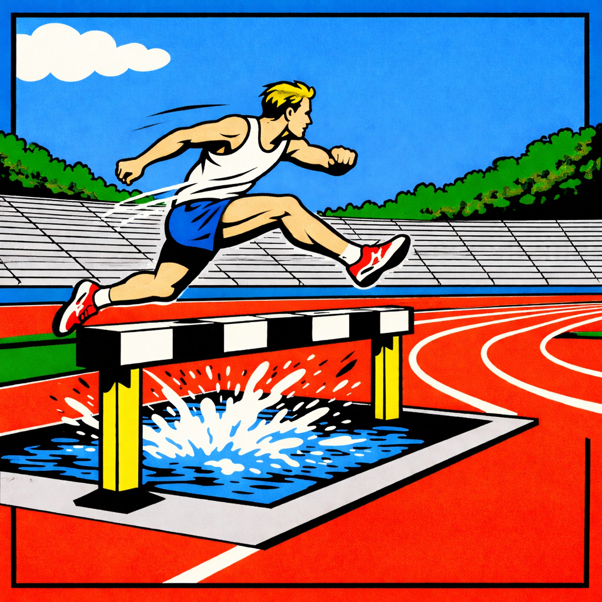
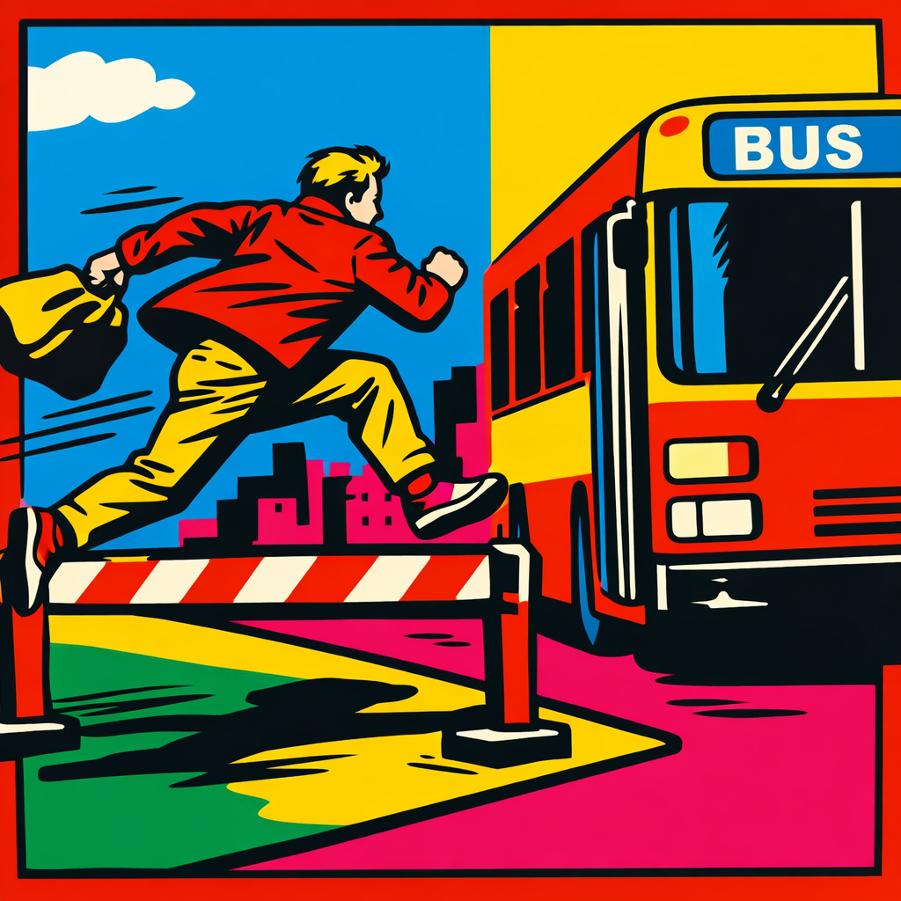
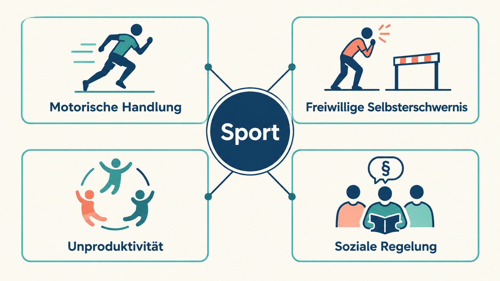
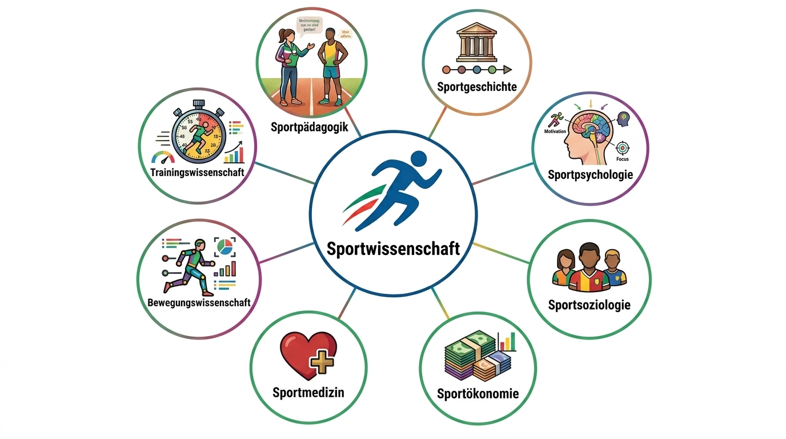
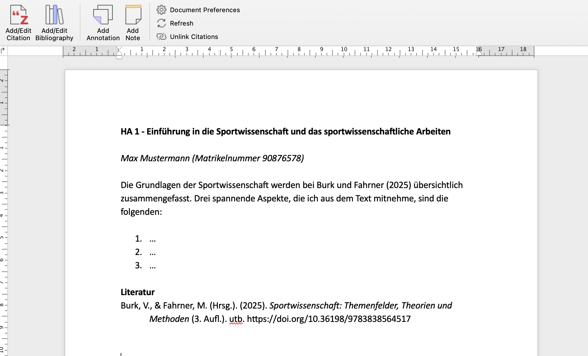

<!--
author: Tim Heemsoth
email: tim.heemsoth@uni-flensburg.de
version: 0.0.1
language: de
narrator: Deutsch Female

import:  https://raw.githubusercontent.com/EUF-SpoWis/BA_PSW_Einfuehrung_Sportwissenschaft/refs/heads/main/config.md

-->

# Grundlagen

[](https://liascript.github.io/course/?https://raw.githubusercontent.com/EUF-SpoWis/BA_PSW_Einfuehrung_Sportwissenschaft/main/02_Grundlagen.md#1)

| Parameter                | Kursinformationen                                                                               |
| ------------------------ | ----------------------------------------------------------------------------------------------- |
| **Veranstaltung:**       | @config.lecture                                                                                 |
| **Semester:**            | @config.semester                                                                                |
| **Hochschule:**          | `Europa-Universität Flensburg`                                                                  |
| **Inhalte:**             | `Grundlegende Orientierungen und Begriffe in der Sportwissenschaft`                             |
| **Link auf GitHub:**     | https://github.com/EUF-SpoWis/BA_PSW_Einfuehrung_Sportwissenschaft/blob/main/02_Grundlagen.md   |
| **Autoren:**             | @author                                                                                         |

> (c) Alle Rechte vorbehalten. 

## Einstieg

{{0-1}}
>[!Tip] Was ist "Sport"? 
> Benenne konstituierende Merkmale, die menschliche Tätigkeiten als "Sport" einordnen lassen.

{{1-2}}
<!--
style="display: block; margin-left: auto; margin-right: auto; max-width: 40%;"
-->


{{2-3}}
<!--
style="display: block; margin-left: auto; margin-right: auto; max-width: 40%;"
-->


## Fahrplan

1. Zum Gegenstand Sport: Historische Entwicklungslinien, Sportbegriff heute, Orientierungen 
2. E-Sport als Sport? 
3. Sportwissenschaft und Wissenschaft
4. Kurze Geschichte der Sportwissenschaft
5. Mit Literatur arbeiten
6. Take-home Messages

## Zum Gegenstand Sport

### Gymnastik, Turnen, Sport
{{0-1}}
********************************************************************************************************************
, gemeinfrei (Public Domain)")
, veröffentlicht über museum-digital:sachsen-anhalt (https://nat.museum-digital.de/singleimage?imagenr=955). Friedrich‑Ludwig‑Jahn‑Museum, Lizenz: CC BY‑NC‑SA 4.0")
")
: Margarethe Streicher. Frau in einer starken Männerwelt. Verlag Brüder Hollinek." )
********************************************************************************************************************

{{1-2}}
********************************************************************************************************************
**Historische begriffliche Vorläufer**

- Johann Christoph Friedrich GutsMuths (1759-1839) prägte den Begriff der *Gymnastik*
- Ludwig Jahn (1778-1852) prägte den Begriff des *Turnens*
- Johann Heinrich Pestalozzi (1746-1827) prägte den Begriff der *Elementargymastik*
- Margartehe Streich (1891-1985) prägte den reformpädagogisch konnotierten Begriff des *natürlichen Turnens*
- Im Zuge der Aufklärung Ende des 18. Jahrhunderts  gewinnt die ganzheitliche Erziehung an Bedeutung, wozu auch die *Leibesübungen* zählen: Laufen, Springen, Werfen, Schwimmen, Turnen, Klettern

********************************************************************************************************************

### Von England nach Deutschland
{{0-1}}
*********
**Rolle des Sports in England...**

<!--
style="
  float: right;
  width: 40%;
  max-width: 420px;
  margin-left: 1.2em;
  margin-bottom: 0.6em;
"
-->

- ... als Freizeitbeschäftigung des Adels, der *leisure class*, ein soziales Distinktionsmerkmal. Hierzu gehörten (s. Fahrner, 2025)
- seit dem 17. und 18. Jahrhundert: das **Reiten** und **Jagen**, der **Segel-** und **Yachtsport**
- seit dem 19. Jahrhundert: auch **Cricket**, **Golf**, **Tennis**, **Boxen**, **Laufen** und **Rudern**

> „Sport“ aus dem französischen (se) de(s)porter – (sich) zerstreuen, (sich) vergnügen (Röthig & Prohl, 2003).

********************************************************************************************************************

<!-- Noch heute sind einige Sportarten in dieser Tradition in gesellschafltichen Schichten besonders vertreten -->

{{1-2}}
********************************************************************************************************************
Entwicklungen in Deutschland
- Erst Ende des 20. Jahrunderts wurde der englische *sports* in Kontinentaleuropa populär und es kam zu einer entsprechenden Begriffsverwendung
- Deutscher Adel in den Großstädten übernimmt den Sport etwa im Bereich Segeln, Golf, Tennis
- 1878 erster Fußballverein in Deutschland (Hannover)
- weiterhin starke Trennung zwischen Turnen und Sport 
********************************************************************************************************************

{{2-3}}
********************************************************************************************************************
**Wetten und Regeln**

--{{2}}--
Sport in England war früh mit Sportwetten verbunden. Damit diese fair geschlossen werden konneten, brauchte es Regeln. Wie wichtig diese waren, zeigt der Ausgang des Oxford-Cambridge-Boat Race 1877.


********************************************************************************************************************

{{3-4}}
********************************************************************************************************************

Typologie von Sportregeln (nach Digel, 2003; Drexel, 1998)

--{{3}}--
Nicht jede Regel legt fest, was *erlaubt* ist. Manche beschreiben das Ziel, andere das Miteinander oder kluge Wege zum Erfolg.

| 🤝 Ethisch-moralische Regeln | 🎯 Regeln zur Sportidee |
|:---|:---|
| Wie gehen wir miteinander um?<br><br>Fair handeln · Niederlagen akzeptieren | Was soll erreicht werden?<br><br>Tore erzielen · höher springen |

| 📏 Konstitutive Regeln | ♟️ Strategische Regeln |
|:---|:---|
| Was macht diese Sportart aus?<br><br>Im Volleyball wird der Ball nicht gefangen. | Wie lässt sich das Ziel erreichen?<br><br>Spieltaktiken wählen und anpassen |

********************************************************************************************************************

{{4-5}}
********************************************************************************************************************

> [!TIP] Welche Art von Regel beschreibt dieser Satz?
> * „Wir spielen den Ball gezielt in die freie Zone.“ <br>
> * "Vor dem Schlagen müssen drei Spieler*innen den Ball halten" <br>
> * "Nach dem Spiel gibt es Shake Hands"

********************************************************************************************************************

### Versportlichung und Entsportlichung

{{0-1}}
> <!-- style="font-size:1.3em" -->
> „Aus einer relativ eng begrenzten Zahl von menschlichen Handlungsmustern, die man mit dem Sammelnamen *Sport* meinte, ist (…) ein diffuses Gemisch an Mustern entstanden, dessen Zuordnung zum ‚Gesamtsortiment Sport‘ in hohem Maße von subjektiven Werturteilen abhängt.“ 
>
> -- (Digel, 1990, S. 77)

{{1-2}}
"Was im allgemeinen unter Sport verstanden wird, ist weniger eine Frage wissenschaftlicher Dimensionsanalysen, sondern wird weit mehr vom alltagstheoretischen Gebrauch sowie von den historisch gewachsenen und tradierten Einbindungen in soziale, ökonomische, politische und rechtliche Gegebenheiten bestimmt. Darüber hinaus verändert, erweitert und differenziert das faktische Geschehen des Sporttreibens selbst das Begriffsverständnis von Sport" (Röthing & Prohl, 2003, S. 493).

### Sport-Definitionen

{{0-3}}
>[!Note] Drei Ansätze
> 1. „Sport ist die **willkürliche** Schaffung von Aufgaben, Problemen oder Konflikten, die vorwiegend **mit körperlichen Mitteln** gelöst werden. Die Lösungen sind beliebig **wiederholbar**, verbesserbar und übbar, und die Handlungsergebnisse führen **nicht unmittelbar zu materiellen Veränderungen**“ (Volkamer, 1987).
>
>{{1-3}} 2. „Sport ist ein **kulturelles Tätigkeitsfeld**, in dem Menschen sich **freiwillig** in eine wirkliche oder auch nur vorgestellte **Beziehung zu anderen Menschen** begeben mit der bewussten Absicht, ihre Fähigkeiten und Fertigkeiten insbesondere im Gebiet der Bewegungskunst zu entwickeln und sich mit diesen Menschen nach selbstgesetzten oder übernommenen **Regeln** zu vergleichen, **ohne sie oder sich selbst schädigen zu wollen**“ (Tiedemann, 2007).
>
>{{2-3}} 3. „Sport ist eine **außeralltägliche**, **unnötige**, **regelbasierte**, **wettkampfförmige**, **fertigkeitenbasierte körperliche** Aktivität oder Praxis, in der kooperiert wird, um [...] überhaupt einen Wettbewerb zu haben, wobei bloße *Sportteilnehmer:innen* die Umsetzung der konstitutiven Regeln einer Sportart erdulden oder tolerieren, während *Sportpraktiker:innen* zudem darauf abzielen [...] den Wettbewerb zu gewinnen, zumindest nicht zu verlieren, an welchem Sportwettkampf sie auch teilnehmen" (Borge, 2022, S. 309, eigene Übersetzung).

{{3-4}}
********************************************************************************************************************
Eine Essenz verschiedener Definitionen 
---


********************************************************************************************************************

### Sport vs. Alltag

Umgekehrte Mittel-Zweck-Relation im Sport
---

--{{0}}--
Der Mensch springt um den Bus zu erreichen. Hier liegt ein *extrasportiver Sinn* vor. <br>
Der Mensch überwältigt ein Hindernis um springen zu können. Hier liegt ein *intrapsortiver Sinn* vor.

 

### DOSB-Kriterien

**Inhaltliche**
1. eigene, sportartbestimmende motorische Aktivität
2. Selbstzweck der Betätigung
3. Einhaltung ethischer Werte wie z. B. Fairplay, Chancengleichheit, Unverletzlichkeit der Person und Partnerschaft durch Regeln und/oder ein System von Wettkampf- und Klasseneinteilungen (s. [DOSB](https://www.dosb.de/wissen/detail/mitglied-im-dosb)).

{{1}}
*****
**Formale Kriterien**

- Vorliegen einer Verandsstruktur
- Anerkennung der Gemeinnützigkeit
****

### Sportmodell nach Heinemann

| Modell                         | Beschreibung                                                                                                         |
|--------------------------------|----------------------------------------------------------------------------------------------------------------------|
| Traditioneller Wettkampfsport  | Meisterschaften und Ligen ohne Profitum mit klaren Regeln (zumeist über Vereine organsiert)                          |
| Professioneller Showsport      | Meisterschaften im Profitum, sportiver Tourismus & Showsport mit ökonomischem Interesse                              |
| Expressiver Sport              | Sporttreiben unter vielfältigen Motiven (Spaß, Freude, Abenteuer, Erleben...) ohne traditionellen Leistungsvergleich |
| Funktionalistischer Sport      | Sport in der "Funktion" zur Förderung körperbezogener Aspekte wie Entspannung, Gedundheit                            |
| Traditionelle Spielkulturen    | Wiederbelebung traditioneller Spiele zur Rückbesinnugn auf eigene Kultur.                                            |

nach Heinemann (1986)

### Strukturprägende Varialben

| Modell / Kernelement           | Bewegung, körperl. Einsatz  | Unproduktivität  | Regeln            | Leistungsbezogen| Willkürlich geschaffene Handlung |
|--------------------------------|-----------------------------|------------------|------------------|------------------|-----------------------------------|
| Traditioneller Wettkampfsport  | gegeben                     | gegeben          | gegeben          | gegeben          | bedingt gegeben                   |
| Professioneller Showsport      | gegeben                     | nicht gegeben    | gegeben          | gegeben          | bedingt gegeben                   |
| Expressiver Sport              | gegeben                     | gegeben          | bedingt gegeben  | bedingt gegeben  | gegeben                           |
| Funktionalisitischer Sport     | gegeben                     | nicht gegeben    | nicht gegeben    | nicht gegeben    | nicht gegeben                     |
| Traditionelle Spielkulturen    | gegeben                     | gegeben          | bedingt gegeben  | bedingt gegeben  | bedingt gegeben                   |

nach Heinemann (1986)

## E-Sport als Sport?

<div style="width: 100%; max-width: 800px; margin: 0 auto;">
  <iframe
    src="https://www.youtube.com/embed/c80dVYcL69E?start=0&amp;end=22"
    title="Counter Strike – Ausschnitt 0 bis 22 Sekunden"
    style="display: block; width: 100%; aspect-ratio: 16 / 9; border: 0;"
    allow="fullscreen; picture-in-picture"
    allowfullscreen>
  </iframe>
</div>

>E-Sport ist der Wettkampf zwischen Menschen auf der virtuellen Ebene eines Computerspiels (Definition durch den E-Sport-Bund Deutschland, 2025).

### E-Sport und Politik

{{0-1}}
>"Wir erkennen die wachsende Bedeutung der E-Sport-Landschaft in Deutschland an. Da E-Sport wichtige Fähigkeiten schult, die nicht nur in der digitalen Welt von Bedeutung sind, Training und Sportstrukturen erfordert, werden wir E-Sport künftig vollständig als eigene Sportart mit Vereins- und Verbandsrecht anerkennen und bei der Schaffung einer olympischen Perspektive unterstützen" (Koalitionsvertrag der Parteien CDU, CSU und SPD, 2018). 

{{1}}
******
>[!TIP] Aufgabe
>Mit welchen Argumenten begründet Jagnow ESport als Sport? Welche seiner Argumente passen zu den zuvor behandelten Merkmalen von Sport – und an welchen Stellen bleiben Fragen offen? 

<div style="width: 100%; max-width: 800px; margin: 0 auto;">
  <iframe
    src="https://www.youtube.com/embed/MG5y5WxmpHI?start=276"
    title="Öffentliche Anhörung zur Entwicklung des eSports in Deutschland – Deutscher Bundestag"
    style="display: block; width: 100%; aspect-ratio: 16 / 9; border: 0;"
    allow="fullscreen; picture-in-picture"
    allowfullscreen>
  </iframe>
</div>

--{{1}}--
**Hintergrund zum Video** <br>
Der  Ausschnitt stammt aus einer öffentlichen Anhörung des Sportausschusses des Deutschen Bundestages vom 20. Februar 2019 zur „Entwicklung des eSports in Deutschland“. Zu Beginn spricht Hans Jagnow, damals Präsident des eSport-Bunds Deutschland (ESBD). Er vertritt damit eine Position in der Debatte – nicht die abschließende Auffassung des Ausschusses. Im Mittelpunkt steht die Frage, ob und unter welchen Voraussetzungen eSport als Sport anerkannt werden sollte.
******

### Postition des DOSB

--{{0}}--
Die Frage, ob eSport als Sport anerkannt werden sollte, lässt sich nicht allein über Wettbewerb und Leistungsorientierung beantworten. Sie berührt mindestens drei klassische Sportkriterien – und zugleich Fragen von Teilhabe, Jugendkultur und Vereinsorganisation.

{{0-1}}
********************************************************************************************************************
>Geklärt wurde NICHT die Frage "Ist E-Sport Sport?" sondern "Lässt sich der E-Sport unter das Dach des organisierten Sports einordnen?"

**Prüfkriterien (u. a.)**
* Motorische Aktivität
* Ethische Normen und Werte
* Gemeinwohlorientierung
* Organisationsform
********************************************************************************************************************

{{1-2}}
********************************************************************************************************************
**Sportartbestimmende motorische Aktivität** <br>
* motorische Aktivität ist Schnittstelle, im Mittelpunkt steht das geschehen der Avatare <-> andererseits es gibt auch Rückmeldungen, auf die reagiert wird 
* viel Sitzen birgt Gefahren für die Gesundheit; Computersiele birgen Sucht- und Gesundheitsrisiko
********************************************************************************************************************

{{2-3}}
********************************************************************************************************************
**Ethische Normen und Werte** <br>
* Zahlreiche Spiele zielen auf die Vernichtung des Gegners
* Anonymität im Netz erschwert soziale Kontrolle (ein Großteil von Spielern macht Erfahrungen mit Schikane und Diffamierung)
********************************************************************************************************************

{{3-4}}
********************************************************************************************************************
**Organisationsstruktur** <br>
* Der ESBD hat keine exklusive Vertretungsfunktion für E-Sport-Aktivitäten 
* (Spiel-)Regeln sind nicht auf Verbandsebene aushandelbar (man ist den ökonomischen Interessen von Spieleherstellern ausgesetzt)
********************************************************************************************************************

{{4-5}}
********************************************************************************************************************
!?[E-Sport bei Kindern mit motorischen Einschränkungen](https://www.youtube.com/watch?v=kW46iX_2tFo)
********************************************************************************************************************

{{5}}
********************************************************************************************************************
**Anderereits** <br>
* E-Sport ermöglicht Teilhabe 
* E-Sport ist Jugendkultur
* E-Sport wird verantwortungsvoll in Vereinen organisiert 
* E-Sport kann Mittel zum Zweck sein, um junge Menschen auch zum analogen Sporttreiben zu motivieren 

>[!Note]Lösung des DOSB
>**Virtuelle Sportarten** (reale Sportarten im virtuellen Raum) vs. **E-Gaming**
********************************************************************************************************************

--{{1}}--
Dieser Position haben sich alle Mitgleiderorganisation angeschlossen. Die Sportministerkonferenz hat nicht zugestimmt, weil einzig SH die Position nicht mittragen wollte.

## Sportwissenschaft

### Wissenschaft

{{0-1}}
********************************************************************************************************************
>[!TIP] Was ist Wissenschaft?
> „Wissenschaft ist jenes menschliche Handeln, das auf die Herstellung solcher Aussagen abzielt, die jenen Aussagen an empirischem und logischem Wahrheitsgehalt überlegen sind, welche schon mittels der Fähigkeiten des 'gesunden Menschenverstandes' formuliert werden können" (Patzelt, 2013, S. 69).
********************************************************************************************************************

{{1-2}}
********************************************************************************************************************
**Konstituive Merkmale von Wissenschaf** <br>
1. Wissenschaft will **wahre Aussagen** über die Wirklichkeit treffen.
2. Wissenschaftliches Handeln ist **methodisch streng geregelt**.
3. Wissenschaft soll **intersubjektiv** prüfbar sein.
4. Wissenschaftliche Aussagen münden in **Theorien und basieren auf Modellen**.
********************************************************************************************************************

### Theorien und Hypothesen

{{0-1}}
********************************************************************************************************************
Eine **Theorie** ist ein strukturiertes System von Aussagen zu einem Gegenstandsbereich mit dem Ziel, das Wissen über die Phänomene dieses Bereichs zu ordnen und zu erklären wie und warum etwas ist. Die Überprüfung der Aussagen erfordert, dass diese in Hypothesen überführt werden können.

Unter einer **Hypothese** versteht man eine allgemeingültige, wissenschaftliche Aussage, die behauptet es gäbe einen Zusammenhang zwischen mindestens zwei Variablen.
********************************************************************************************************************

{{1-2}}
********************************************************************************************************************
**Gütekriterien von Theorien (u. a. Beck & Krapp, 2001)**

1. **Falsifizierbarkeit**: Theorien sollen an der Realität scheitern können.
2. **Widerspruchsfreiheit**: Die Aussagen der Theorie sollen sich nicht wiedersprechen. 
3. **Empirische Prüfbarkeit**: Theorien sollten empirisch prüfbar sein.
4. **Implikation und Quantifizierbarkeit**: Theorien sollten eine implikative („Wenn-Dann“-)Struktur aufweisen.
5. **Intersubjektivität**: Die theoretischen Aussagen sollen verallgemeinerungsfähig sein.
********************************************************************************************************************

{{2}}
**Inwieweit erfüllen die Aussagen die Gütekriterien?**

{{3}}
> „Steht ein Hahn auf’m Mist, ändert sich’s Wetter oder es bleibt, wie es ist.“

{{4}}
> „Regelmäßiges Mannschaftssporttreiben stärkt den Teamgeist.“

{{5}}
> „Wenn Schüler*innen in der Nacht vor einer Prüfung mindestens acht Stunden schlafen, erzielen sie im Mittel bessere Prüfungsergebnisse als Schüler*innen, die weniger als sechs Stunden schlafen.“

{{6}}
> „In unserer Seminargruppe verbessert Sport immer die Konzentration.“

### Beispiel: Globalmodell motivierten Handelns

```ascii
+------------------------------------+
|               Person               |
|     Bedürfnisse, Motive, Ziele     |
+------------------------------------+
                  |                                                          +----------------------------+
                  |                                                          |           Folgen           |
                  v                                                          |                            |
+------------------------------------+    +------------+    +------------+   | - Langfristige Ziele       |
|        Person x Situation          |    |            |    |            |   | - Fremdbewertung           |
|            Interaktion             +--->|  Handlung  +--->|  Ergebnis  +-->| - Selbstbewertung          |
|                                    |    |            |    |            |   | - Materielle Vorteile      |
+------------------------------------+    +------------+    +------------+   |                            |
                  ^                                                          |                            |
                  |                                                          +----------------------------+
                  |
+------------------------------------+
|             Situation              |
| Gelegenheiten, mögliche Anreize    |
+------------------------------------+
```

Gabler 2000

## Kurze Geschichte der Sportwissenschaft

{{0-1}}
********************************************************************************************************************
**Was ist Sportwissenschaft?**

> Sportwissenschaft zielt darauf ab, mit Hilfe wissenschaftlicher Methoden „die differenzierten Phänomene von Sport, Bewegung und körperlicher Aktivität wahrzunehmen, zu beschreiben, zu analysieren und zu erklären sowie Orientierungen und Entscheidungshilfen für die Verbesserung der vielfältigen Praxis zu entwickeln" (Hottenrott et al, 2017, S. 288).

********************************************************************************************************************

{{1}}
*****
> Sportwissenschaft entstand nicht als einheitliche Disziplin. Sie entwickelte sich im Zusammenspiel von Lehrerbildung, Gesundheit, Leistungssport, Politik und gesellschaftlichen Erwartungen an Bewegung.
*****

### Anfänge in Deutschland
- Um 1800 betonen philanthropische Pädagogen die Bedeutung körperlicher Aktivität für die ganzheitliche Entwicklung des Menschen.
- Im Mittelpunkt steht zunächst die Leibeserziehung, nicht die heutige Sportwissenschaft.
- Im 19. Jahrhundert entstehen erste Turnlehrerbildungsanstalten – zunächst außerhalb der Universitäten.

### Institutionalisierung
- 1920 wird in Berlin die Deutsche Hochschule für Leibesübungen (DHfL) gegründet. 
- Sie verbindet die Ausbildung von Sportlehrkräften mit Forschung zur Leibeserziehung.
- 1925 wird  in Leipzig auf die erste außerplanmäßige Professur für Pädagogik der Leibesübungen eingerichtet
- Leibesübungen werden damit schrittweise Teil universitärer Lehre und Forschung.

> [!WARNING] 💡
> Die frühe Sportwissenschaft war zunächst vor allem eine Wissenschaft der Leibeserziehung und Lehrerbildung.

### Nationalsozialismus
- Die Nationalsozialisten werten die Leibeserziehung politisch auf.
- Körperliche Leistungsfähigkeit, Disziplin, Wehrhaftigkeit und Auslese werden zentrale Bezugspunkte.
- Wissenschaft und Ausbildung werden in die NS-Ideologie eingebunden.
- 1935 wird die DHfL in die Deutsche Reichsakademie für Leibesübungen überführt.

> [!WARNING]💡
> Institutioneller Ausbau bedeutet nicht automatisch wissenschaftlichen Fortschritt: Sport und Wissenschaft werden im Nationalsozialismus ideologisch und politisch instrumentalisiert.

### Sportwissenschaft in der BRD - DDR

{{0-1}}
*****
**BRD**
- Nach 1945 wird Sportwissenschaft an Universitäten zunächst skeptisch gesehen; die Bezeichnung „Fakultas der Bauchmuskeln“ steht dafür.
- In den 1960er- und 1970er-Jahren fördern Bildungsexpansion, gesellschaftliches Sportinteresse und internationale
  Leistungssportkonkurrenz den Ausbau.
- Die Erfolge der DDR sowie die Olympischen Spiele 1972 in München verstärken den politischen Druck.
- Ab 1966 entstehen zahlreiche Professuren und Lehrstühle.
- 1970: Gründung des Bundesinstituts für Sportwissenschaft (BISp).
- 1971: Erste Ausgabe der Fachzeitschrift *Sportwissenschaft*.
- 1976: Gründung der Deutschen Vereinigung für Sportwissenschaft (dvs).
*****

{{1-3}}
*****
**DDR**
- 1950: Gründung der Deutschen Hochschule für Körperkultur (DHfK) in Leipzig.
- Die DHfK wird zur zentralen Ausbildungs- und Forschungsstätte für Körperkultur, Schulsport und Leistungssport.
- Trainingswissenschaft wird zu einer Kernwissenschaft des DDR-Leistungssports.
- 1969: Gründung des Forschungsinstituts für Körperkultur und Sport (FKS) in Leipzig.
- Forschung konzentriert sich unter anderem auf Trainingssteuerung, Leistungsdiagnostik, Biomechanik und Sportmedizin.
*****

{{2-3}}
*****
> [!WARNING]💡
> Die hohe Leistungsfähigkeit der DDR-Sportwissenschaft ist eng mit staatlicher Steuerung, eingeschränkter Forschungsautonomie und dem DDR-Dopingkomplex verbunden.
*****

### Nach 1990 und heute

{{0-2}}
*****
- grundlegend umstrukturiert; die DHfK wird abgewickelt.
- Sportwissenschaft ist heute ein interdisziplinäres Fach.
- Sie verbindet Trainings- und Bewegungswissenschaft, Sportmedizin,
  Sportpädagogik, Sportpsychologie, Sportsoziologie, Sportökonomie und
  Sportmanagement.
- In Deutschland studieren rund 30.000 Menschen im Fachgebiet Sport.
- 54 universiäre Einrichtungen zur Sportwissenschaft in Deutschland
*****

{{1-2}}
*****
> [!WARNING]💡
> Sportwissenschaft entwickelte sich von der Leibeserziehung und Turnlehrerbildung über die Institutionalisierung an Hochschulen und die leistungsorientierte Forschung im Kalten Krieg hin zu einer interdisziplinären Wissenschaft von Bewegung, Sport und körperlicher Aktivität.
*****

{{2-3}}
*****

*****

## Mit Literatur arbeiten

### Literatur verwalten
>[!Tip] Literatur in Zotero verwalten
> 1. Installiere Zotero und registriere einen Account. Installiere den Zotero Connector (ein Plug-In für den Browser) und das Plug-in für Word.
> 2. Speicher den Buchbeitrag  "Fahrner, 2025" in Zotero ab und editiere die Informationen so, dass folgende Informationen enthalten sind: Fahrner, M. (2025) Sportwissenschaft als Fachdisziplin. In V. Burk & M. Fahrner (Hrsg.), *Sportwissenschaft*, S. 19-56. utb https://doi.org/10.36198/9783838564517 (s. Abbildung 1)
> 3. Lege eine neue Sammlung mit Titel "PSW-Einführung_Sport" an und ordne die Quelle dieser Sammlung zu. 
> 4. Speicher im Verlauf des Semesters jede für relevante Quelle sofort in Zotero – nicht erst bei Beginn einer Hausarbeit. Ergänzen Sie aussagekräftige Schlagwörter und kurze Notizen dazu, wofür eine Quelle später nützlich sein könnte.


### Mit Literatur arbeiten 
>[!TIP] Literatur aus Zotero verwenden
> 1. Schreibe einen Satz in ein Worddokument und füge das Jahr der Quelle über den Zotero-Plug-in ein. Dabei wähle den Zitationsstyle "APA Style 7th edition" (klicke auf  Abbildungen 2, 3 und 4). Der Satz soll lauten: 
> "Die Grundlagen der Sportwissenschaft werden bei Burk und Fahrner (2025) übersichtlich zusammengefasst. Drei spannende Aspekte, die ich aus dem Text mitnehme, sind die folgenden:".
> 2. Ergänze drei für dich spannende Aspekte.
> 3. Ergänze über das Zotero-Plug in die Literatur(-liste), die in diesem Fall aus genau einer Quelle besteht (klicke auf Abbildung 5).
> 4. Lade das Dokument in Moodle hoch.




## Take-home Messages

1. Sport ist ein historisch gewachsenes, wandelbares Tätigkeitsfeld, dessen unterschiedliche Formen sich anhand von Merkmalen motorische Aktivität, freiwillige Selbsterschwernis, Unproduktivität und soziale Normen einordnen lassen.

2. Die Debatte um E-Sport zeigt, dass die begriffliche Einordnung als Sport von der Anerkennung im organisierten Sport zu unterscheiden ist und beide Entscheidungen nachvollziehbare Kriterien benötigen.

3. Wissenschaft geht über Alltagswissen hinaus, indem sie Aussagen methodisch begründet, intersubjektiv überprüfbar macht und Theorien anhand empirisch prüfbarer Hypothesen kritisch untersucht.

4. Sportwissenschaft untersucht Sport, Bewegung und körperliche Aktivität aus unterschiedlichen disziplinären Perspektiven, um Phänomene zu beschreiben, zu erklären und wissenschaftlich begründete Orientierung für die Praxis zu geben.

5. Die Geschichte der Sportwissenschaft zeigt, dass ihre Entwicklung eng mit Bildung, Gesundheit, Leistungssport und Politik verbunden ist und institutionelle Förderung in der Vergangeheit nicht automatisch wissenschaftliche Unabhängigkeit oder ethischen Fortschritt bedeutet.

## Hausaufgabe

1. Vertiefe die Vorlesung mit dem Text Fahrner, M. (2025) Sportwissenschaft als Fachdisziplin. In V. Burk & M. Fahrner (Hrsg.), *Sportwissenschaft* (S. 19-56). utb https://doi.org/10.36198/9783838564517
2. Welche gesellschaftlichen Probleme sollte Sportwissenschaft in den jeweiligen Zeitphasen lösen – und welche Probleme sollte sie heute bearbeiten?
2. Bearbeite die "Zotero-Aufgaben" im Teilabschntitt zu  "Mit Literatur arbeiten".

## Literatur

<div style="padding-left: 2em; text-indent: -2em;">
Beck, K., Krapp, A. (2001): Wissenschaftstheoretische Grundfragen der Pädagogischen Psychologie. In A. Krapp, B. Weidenmann (Hrsg.), *Pädagogische Psychologie. Ein Lehrbuch.* (4. Aufl., S. 31-73). Beltz.


Borge, S. (2020). What Is Sport? *Sport, Ethics and Philosophy, 15*(3), 308–330. https://doi.org/10.1080/17511321.2020.1760922 

Digel, H. (1990). Die Versportlichung unserer Kultur und deren Folgen für den Sport – ein Beitrag zur Uneigentlichkeit des Sports. In H. Gabler, & U. Göhner (Hrsg.), *Für einen besseren Sport… Themen, Entwicklungen und Perspektiven aus Sport und Sportwissenschaft* (S. 73–96). Hofmann.

Digel, H. (2003). Sportregeln. In P. Röthig, & R. Prohl (Hrsg.), *Sportwissenschaftliches Lexikon* (7. Auflage, S. 533–534). Hofmann.

Drexel, G. (1998). Regel. In O. Grupe, & D. Mieth (Hrsg.), *Lexikon der Ethik im Sport* (S. 430–436). Hofmann.

Fahrner, M. (2025) Sportwissenschaft als Fachdisziplin. In V. Burk & M. Fahrner (Hrsg.), *Sportwissenschaft* (S. 19-56). utb https://doi.org/10.36198/9783838564517 

Gabler, H., Nitsch, J. & Singer, R. (2000). *Einführung in die 	Sportpsychologie*. Hofmann

Heinemann, K. (1986). Zum Problem der Einheit des Sports und des Verlusts seiner Autonomie. In Deutscher Sportbund (Hrsg.), *Materialien zum Kongreß „Menschen im Sport 2000“* (S. 112–128). Hofmann.

Hottenrott, K., Baldus, A., Braumann, K.-M., Hartmann-Tews, I., Holzweg, M., Kuhlmann, D., Seyfarth, A., Strauß, B., Sygusch, R., & Vogt, L. (2017). Memorandum Sportwissenschaft. *German Journal of Exercise and Sport Research, 47*(4), 287–293. https://doi.org/10.1007/s12662-017-0476-x 

Patzelt, W. J. (2013). *Einführung in die Politikwissenschaft: Grundriß des Faches und studiumbegleitende Orientierung* (7., überarbeitete und wesentlich erweiterte Aufl.). Wissenschaftsverlag Richard Rothe. 

Röthin, P & Prohl, R. (2003) *Sportwissenschaftliches Lexikon*. Hofmann. 

Tiedemann , K. (2007). Was ist der Gegenstand der Sportwissenschaft? In M. Lämmer et al. (Hrsg.), *New Aspects of Sport History. Proceedings of the 9th ISHPES Congress Cologne 2005* (p. 435-440). Academia. 

Volkamer, M.  (1987). *Von der Last mit der Lust im Schulsport: Probleme der Pädagogisierung des Sports.* Hofmann.